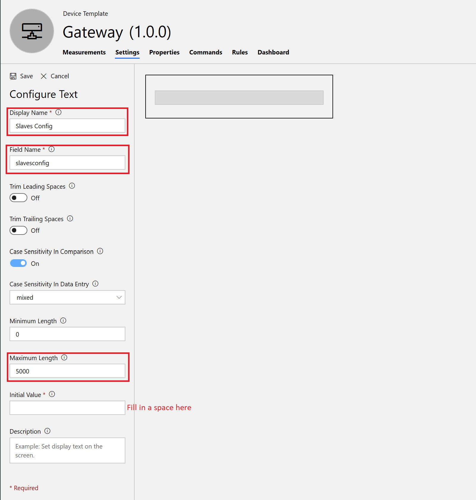
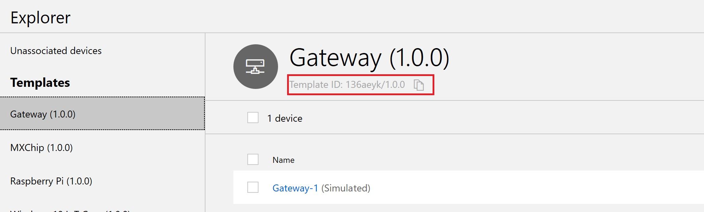
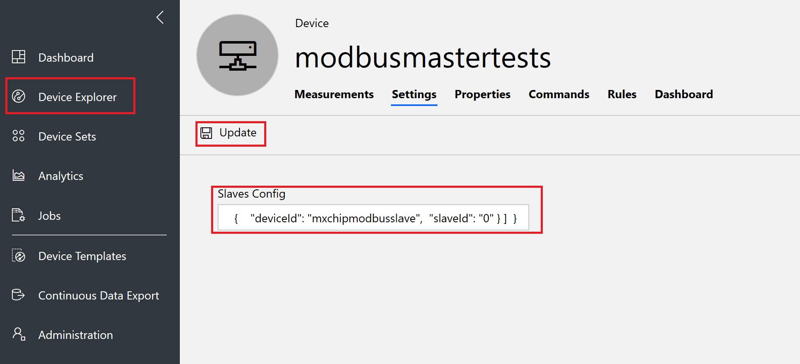

# IoT Central Gateway for Modbus Devices

## Prerequisites

- Azure Subscription
- Python 2.7
- Install python packages: 

```bash
pip install retrying iotc pymodbus
```

## Running the sample with a simulated modbus device

### Creating Azure Resources

1. Create an IoT Central application
    -Visit [AzureIoTCentral](https://apps.azureiotcentral.com) and create a **New Application**.
    - Under **Choose a payment plan** select **Pay-As-You-Go**.
    - Under **Select an application template** select **Sample Devkits**.
    - Configure your application name, URL, and billing information (First 5 devices are free).
2. Create the template for your Modbus Gateway device
    - From the nav bar on the left, select **Device Templates**, click the **+** on the upper right corner, and select **Custom**.
    - Name your template.
    - Go to the **Settings** tab on the template and create a new Text setting with the following parameters:
    
    - From the **Device Explorer**, select the template you have just created and note the Template Id:
    

### Running the sample
1. Configure `config.py`
    - From the **Administration** pane on the IoT Central app, select **Device connection** and note the **Scope ID** and **Primary Key** for the app.
    - Clone this repo onto your master device and open `config.py`.
    - Under `IoT Central parameters`, replace the placeholder values with the values noted from earlier.
2. Run the sample
    - From your terminal, navigate to the root directory of the repo and run:
    ```bash
    python main.py
    ```
    - The following output should appear:
    ```
    2019-05-07 14:18:55,713:[device.start()]: Starting loop for device modbusmastertests
    2019-05-07 14:19:09,556:[device._on_connect()]: Connected/Disconnected modbusmastertests successfully
    2019-05-07 14:19:09,558:[device._on_message_sent()]: Sent message for modbusmastertests successfully
    2019-05-07 14:19:09,588:[device.start()]: Started loop for device modbusmastertests
    2019-05-07 14:19:09,809:[device._on_settings_updated()]: Settings updated for modbusmastertests. slavesconfig: {u'$version': 1, u'value': u' '}
    2019-05-07 14:19:09,825:[master_device._process_setting()]: Received config file:

    2019-05-07 14:19:09,826:[master_device._process_setting()]: ValueError or KeyError has occured while parsing JSON: No JSON object could be decoded
    2019-05-07 14:19:09,828:[device._on_settings_updated()]: Settings updated for modbusmastertests. echo: {u'$version': 1, u'value': 0}
    ```
    - From the **Device Exporer** pane, navigate to your template. There should now be a new device **modbusmastertest**. Select the device, then copy the contents of sampleconfig.txt into the text setting for **Slaves Config** and click **Update**:
    

    - After a few moments, a new Real device will appear under the **MX Chip** template with simulated **Temperature** and **Humidity** data. You may also set the **Voltage** setting, and your master device will print that it is simulating a voltage write. 

## Config file structure and explanation

Currently, this code only supports homogenous slave devices. The config file pushed down to the master device follows this structure:

```json
{
    "modelId": "slavemodelID", 
    "updateInterval": 1,
    "activeRegisters":
    [
        {
            "registerName": "sensor1",
            "address": 0,
            "type": "ir"
        },
        {
            "registerName": "sensor2",
            "address": 1,
            "type": "ir"
        },
        {
            "registerName": "setting1",
            "address": 0,
            "type": "hr"
        },
        {
            "registerName": "coil1",
            "address": 0,
            "type": "co"
        },
        {
            "registerName": "discreteinput1",
            "address": 0,
            "type": "di"
        }
    ],
    "slaves": 
    [
        {
            "deviceId": "slave2",
            "slaveId": 0
        },
        {
            "deviceId": "slave1",
            "slaveId": 1
        }
    ]
}
```
- `modelId`: This is the template Id for your slave devices
- `updateInterval`: The period for sending data to IoT Central, in seconds
- `activeRegisters`: List of active Modbus registers for the slave devices
    - `registerName`: The name of the register, which corresponds to the field name for the measurement/setting on IoT Central
    - `address`: Modbus address for the register
    - `type`: Register type - if not specified on your device, it is most likely a holding register. Type abbreviations are as follow:
        - Holding register: `hr`
        - Input register: `ir`
        - Coil: `co`
        - Discrete Input: `di`
- `slaves`: List of slaves controlled by the master device
    - `deviceId`: Device Id, corresponds to the Device Id that will display on IoT Central
    - `slaveId`: Modbus Slave Id - for serial Modbus devices, this will be an integer, while for TCP/IP devices this will be an IP address as a string

## Connecting real modbus devices

1. Physically connect your Modbus slave devices to the master device.
2. Create a template for your slave devices on the IoT Central app with the appropriate measurements and settings.
3. Configure the `Modbus parameters` section in `config.py` and restart the program.
4. Create a config file using the structure specified above and push it down to the master device from the Slaves Config setting.
